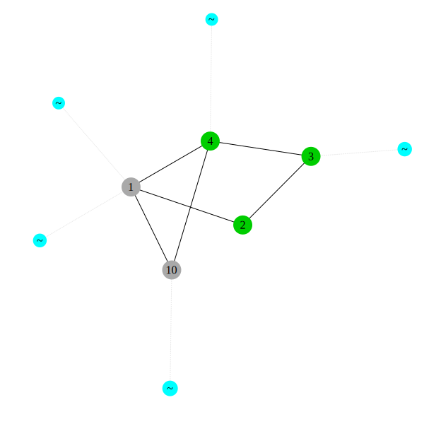
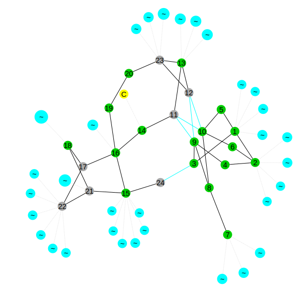
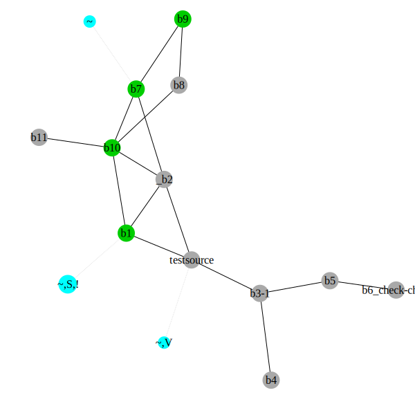

# Quick Start Guide
Once PowerModelsAnalytics.jl is installed, Plots.jl is installed, and a Plots.jl backend is installed (we will use Plotly, which is included in Plots.jl, for this guide), and a network data file (e.g. `case5.m"` in the PowerModels.jl package folder under `./test/data/matpower`) has been acquired, the network can be plotted with,

```julia
using PowerModels, PowerModelsAnalytics
using Plots
plotly()

data = PowerModels.parse_file("$(joinpath(dirname(pathof(PowerModels)), ".."))/test/data/matpower/case5.m")
plot_network(data)
```

## IJulia Example Output


```julia
using PowerModelsAnalytics
import PowerModels
import PowerModelsDistribution
import Ipopt

PowerModels.silence()
```


```julia
ENV["GRDIR"]=""
import Plots
Plots.gr()
```


    Plots.GRBackend()


```julia
case5 = PowerModels.parse_file("$(joinpath(dirname(pathof(PowerModels)), ".."))/test/data/matpower/case5.m");
case24 = PowerModels.parse_file("$(joinpath(dirname(pathof(PowerModels)), ".."))/test/data/matpower/case24.m");
case_distribution = PowerModelsDistribution.parse_file("$(joinpath(dirname(pathof(PowerModelsDistribution)), ".."))/test/data/opendss/test2_master.dss");
```


```julia
graph = plot_network(case5;
    node_size_limits=[10, 15],
    edge_width_limits=[2, 3],
    label_nodes=true,
    fontsize=10,
    plot_size=(600,600),
    plot_dpi=100);
```





```julia
graph = plot_network(case24; aggregate_extra_nodes=true,
    node_size_limits=[10, 15],
    edge_width_limits=[2, 3],
    label_nodes=true,
    fontsize=10,
    plot_size=(600,600),
    plot_dpi=100);
```





```julia
graph = plot_network(case_distribution; aggregate_extra_nodes=true,
    node_size_limits=[10, 15],
    edge_width_limits=[2, 3],
    label_nodes=true,
    fontsize=10,
    plot_size=(600,600),
    plot_dpi=100);
```




