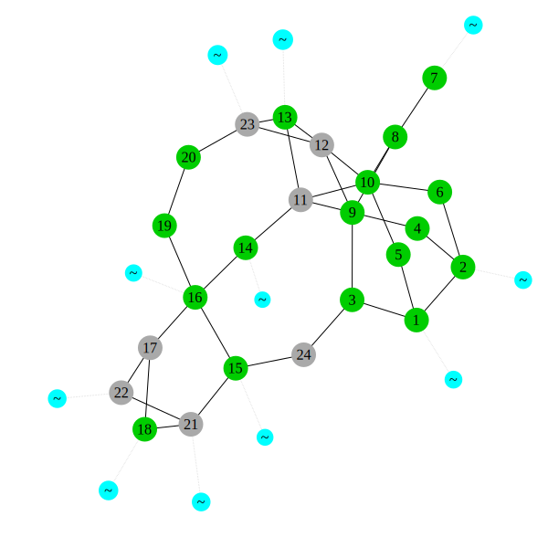

# Quick Start Guide
Once PowerModelsAnalytics.jl is installed, Plots.jl is installed, and a Plots.jl backend is installed (we will use Plotly, which is included in Plots.jl, for this guide), and a network data file (e.g. `case5.m"` in the PowerModels.jl package folder under `./test/data/matpower`) has been acquired, the network can be plotted with,

```julia
using PowerModels, PowerModelsAnalytics
using Plots
plotly()

data = PowerModels.parse_file("$(joinpath(dirname(pathof(PowerModels)), ".."))/test/data/matpower/case5.m")
plot_network(data)
```

## IJulia Example Output


```julia
using PowerModels, PowerModelsAnalytics
```


```julia
using Pkg
ENV["GRDIR"]=""
Pkg.build("GR")
```

      Building GR → `~/.julia/packages/GR/ZI5OE/deps/build.log`


```julia
using Plots
Plots.gr()
```


    Plots.GRBackend()


```julia
data = PowerModels.parse_file("$(joinpath(dirname(pathof(PowerModels)), ".."))/test/data/matpower/case24.m")
```

    [info | PowerModels]: extending matpower format with data: areas 4x3
    [warn | PowerModels]: angmin and angmax values are 0, widening these values on branch 38 to +/- 60.0 deg.
    [warn | PowerModels]: reversing the orientation of branch 37 (23, 20) to be consistent with other parallel branches
    [info | PowerModels]: removing 1 cost terms from generator 1: [13000.0, 400.685]
    [info | PowerModels]: removing 1 cost terms from generator 29: [0.1, 0.001]
    [info | PowerModels]: removing 1 cost terms from generator 2: [13000.0, 400.685]
    [info | PowerModels]: removing 1 cost terms from generator 6: [13000.0, 400.685]
    [info | PowerModels]: removing 1 cost terms from generator 25: [0.1, 0.001]
    [info | PowerModels]: removing 1 cost terms from generator 5: [13000.0, 400.685]
    [info | PowerModels]: removing 3 cost terms from generator 15: Float64[]
    [info | PowerModels]: removing 1 cost terms from generator 27: [0.1, 0.001]
    [info | PowerModels]: removing 1 cost terms from generator 28: [0.1, 0.001]
    [info | PowerModels]: removing 1 cost terms from generator 26: [0.1, 0.001]
    [info | PowerModels]: removing 1 cost terms from generator 30: [0.1, 0.001]


    Dict{String,Any} with 13 entries:
      "bus"            => Dict{String,Any}("24"=>Dict{String,Any}("zone"=>1,"bus_i"…
      "source_type"    => "matpower"
      "name"           => "case24"
      "dcline"         => Dict{String,Any}()
      "source_version" => "2"
      "gen"            => Dict{String,Any}("24"=>Dict{String,Any}("pg"=>2.9631,"mod…
      "branch"         => Dict{String,Any}("24"=>Dict{String,Any}("br_r"=>0.0022,"r…
      "storage"        => Dict{String,Any}()
      "baseMVA"        => 100.0
      "per_unit"       => true
      "areas"          => Dict{String,Any}("4"=>Dict{String,Any}("source_id"=>Any["…
      "shunt"          => Dict{String,Any}("1"=>Dict{String,Any}("source_id"=>Any["…
      "load"           => Dict{String,Any}("4"=>Dict{String,Any}("source_id"=>Any["…


```julia
graph = PowerModelsAnalytics.plot_network(mp_data;
    node_size_lims=[10, 15],
    edge_width_lims=[2, 3],
    label_nodes=true,
    fontsize=10,
    plot_size=(600,600),
    dpi=100);
```





```julia
plot_network(PowerModels.parse_file("$(joinpath(dirname(pathof(PowerModels)), ".."))/test/data/matpower/case5.m"));
```

    [warn | PowerModels]: reversing the orientation of branch 6 (4, 3) to be consistent with other parallel branches
    [warn | PowerModels]: the voltage setpoint on generator 4 does not match the value at bus 4
    [warn | PowerModels]: the voltage setpoint on generator 1 does not match the value at bus 1
    [warn | PowerModels]: the voltage setpoint on generator 5 does not match the value at bus 10
    [warn | PowerModels]: the voltage setpoint on generator 2 does not match the value at bus 1
    [warn | PowerModels]: the voltage setpoint on generator 3 does not match the value at bus 3
    [info | PowerModels]: removing 1 cost terms from generator 4: [4000.0, 0.0]
    [info | PowerModels]: removing 1 cost terms from generator 1: [1400.0, 0.0]
    [info | PowerModels]: removing 1 cost terms from generator 5: [1000.0, 0.0]
    [info | PowerModels]: removing 1 cost terms from generator 2: [1500.0, 0.0]
    [info | PowerModels]: removing 1 cost terms from generator 3: [3000.0, 0.0]


